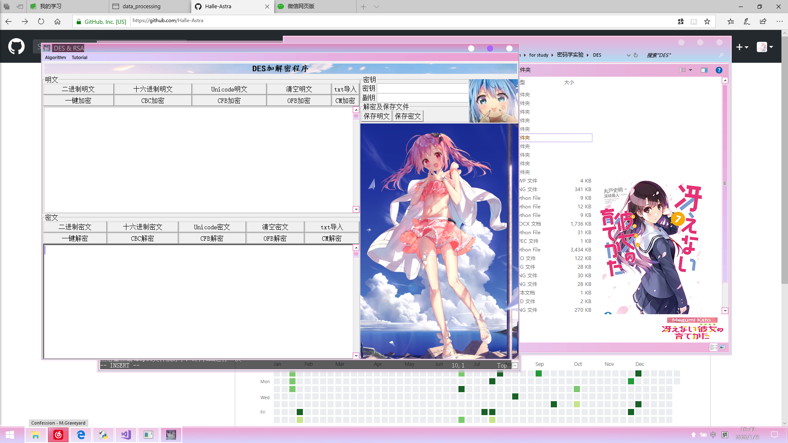
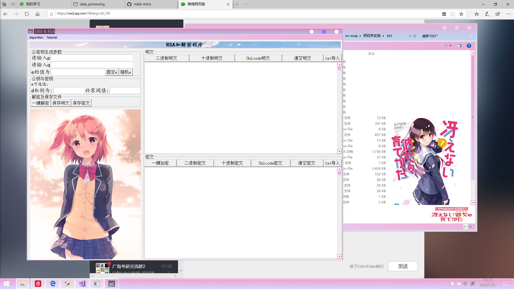

# DES&RSA密码学实验

## 程序的说明

1. 本程序内置密钥为“哈哈哈哈”，我懒得每次都输入密钥，hhhhh。
2. 一些冗余代码我实在是懒得整理了，抱歉。<(_ _)>
3. 直接运行DESandRSA.py即可。该文件仅调用了DES.py.
4. DES.py与DES\_GUI.py可独立使用。此时结果仅与DES算法有关。
5. 图片请正确放置，所有相关的代码与py文件都需要放在同个文件夹下，避免图片文件读取不到从而报错，本死宅的代码一定要用二次元图作为背景才舒服，吐舌。
6. 鄙人不才，exe程序加载可能有点慢，非计科出身QAQ。

## exe文件的编译

本代码，将DES与RSA结合放在一个程序中。

如下是一些编译软件时遇到的问题的备忘：

使用如下语句进行编译

`pyinstaller DESandRSA.py -F -w -i icon.ico`

编译时会遇到问题，意思是说“超出系统最大递归深度限制”。某个库玩嗨了额...orz。

然后此时，会多出个`DESandRSA.spec`文件，这个文件是一些编译信息。

在这个文件中添加如下语句：

`import sys
sys.setrecursionlimit(100000)`

然后命令行敲：

`pyinstaller DESandRSA.spec`

此时还会遇到错误：

`'utf-8' codec can't decode byte 0xce in position 129: invalid continuation byte`

这里，我们就转换系统到utf-8编码重新编译这个文件就好了。

即，在cmd中输入

`chcp 65001`

65001是utf-8的代码页。emmm，我也不是很懂。

然后重新编译spec文件就好了，即再cmd运行一次

`pyinstaller DESandRSA.spec`

最终程序运行界面为

